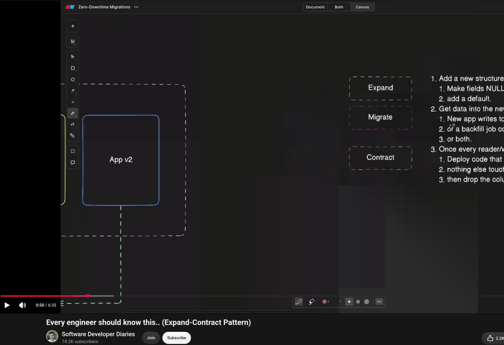
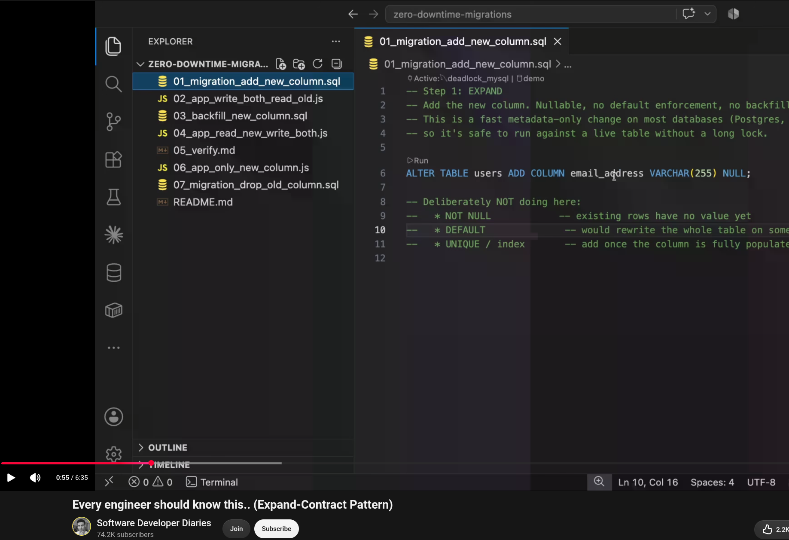
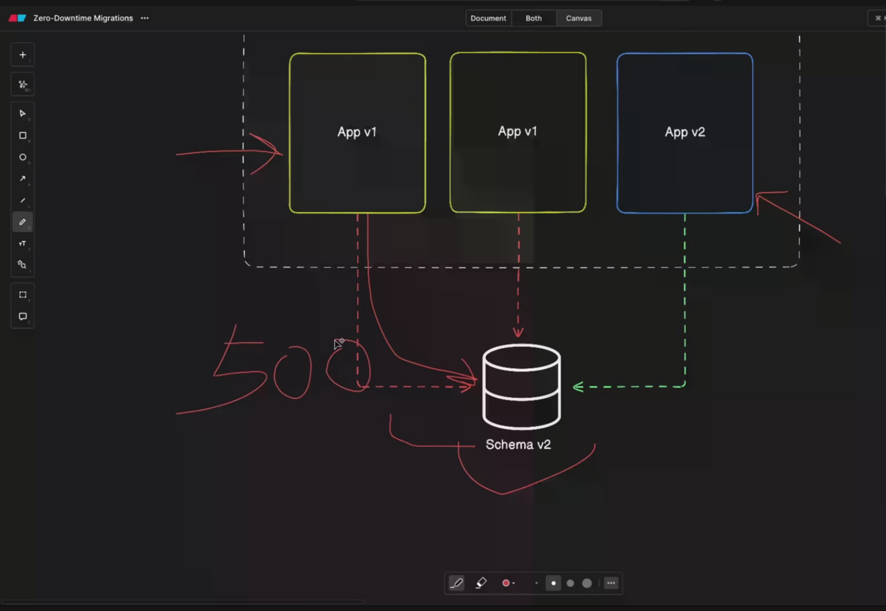
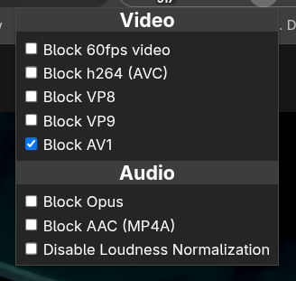

# AMD AV1 Video Decoding Bug

## Issue

On linux distros such as Fedora, some chromium based browsers such as Google Chrome is showing colored blocks while rendering av1 encoded videos.

It is observed in AMD graphics cards. The cause seems to be the 20260810 amd linux-firmware update.

### Images

Some mentions of the issue:

- https://gitlab.freedesktop.org/drm/amd/-/work_items/5615

- https://bbs.archlinux.org/viewtopic.php?id=314616

- https://github.com/brave/brave-browser/issues/54436

## Solution

It seems the issue has been patched, but based on the linux distro, and the software source type (flatpak etc.), it might take time until the update becomes available.

In the meantime the workaround is installing [enhanced-h264ify](https://chromewebstore.google.com/detail/enhanced-h264ify/omkfmpieigblcllmkgbflkikinpkodlk) chrome extension and blocking `av1` format. The extension is open-source, the source code is available at [github.com/alextrv/enhanced-h264ify](https://github.com/alextrv/enhanced-h264ify).

